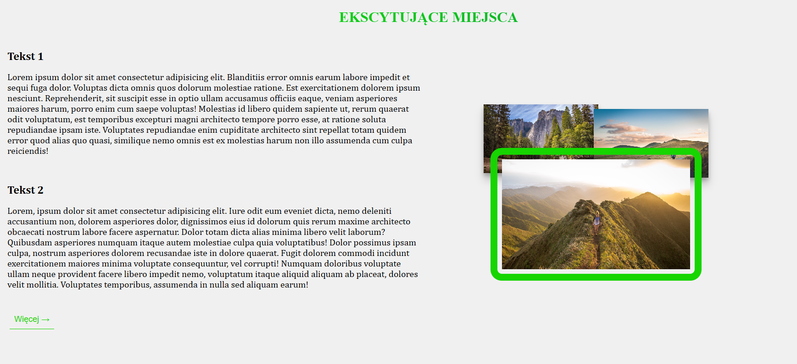
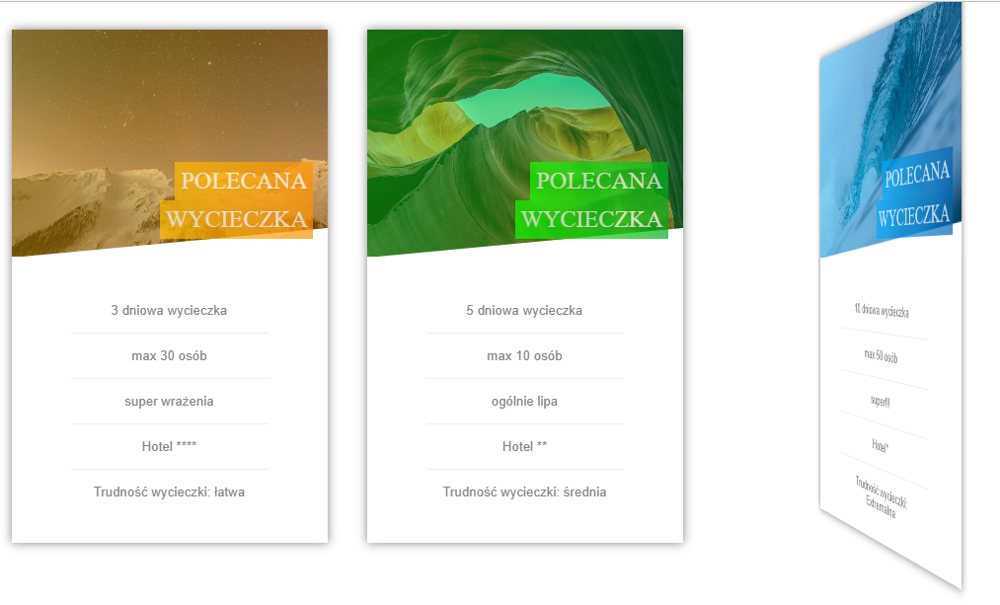

# WDAI
Course "Wprowadzenie do aplikacji internetowych" at AGH UST.

## Versions:
Node: v16.15.0
Angular CLI: 13.0.4
npm: 8.5.5

## Course summary:
### Description:
This course contains 5 assignments for labolatories.

### Lab 2 & 3:
Those labolatories principally were teaching about html, css and javascript.
Different tasks about using basic languages for creating web pages.

### Lab 4,5,6:
In last three labs there was being developed a project in Angular. 
This project presents a web platform for managing a restaurant.
Angular was used along with typescript.
It contains 4 basic views:

- **home view with main page of restaurant that welcomes clients**

- **menu, where clients can choose what to order**

- **manager view, where manager and admin has only access. There dishes are administrated.**

- **admin view, where only admin has access. Admin controls users and permissions to website.**

Beyond that we can register and log into web, also check details about dish or filter the menu.