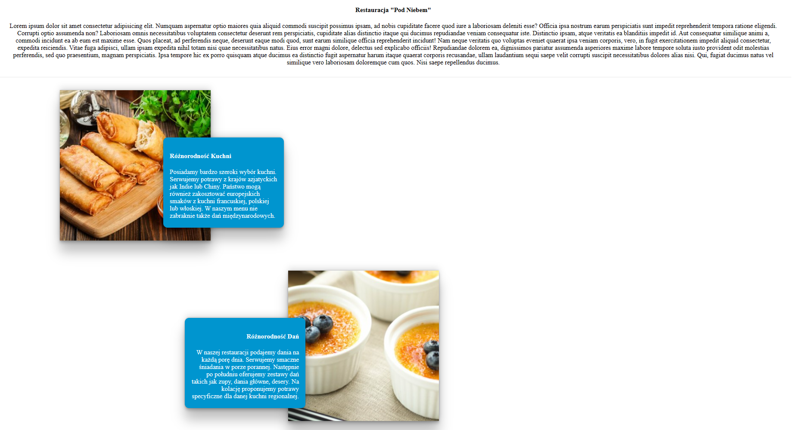
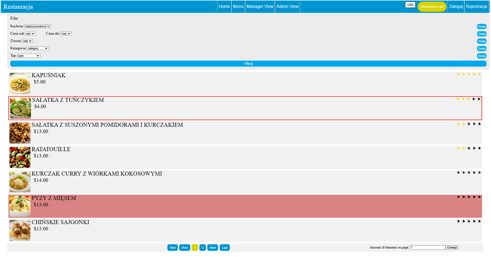
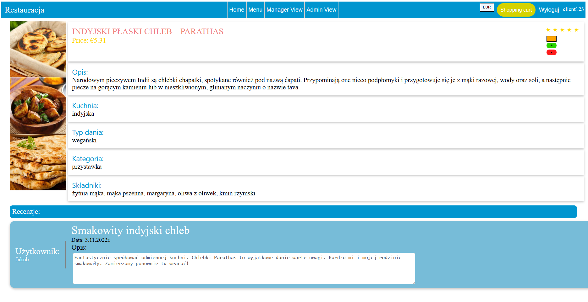
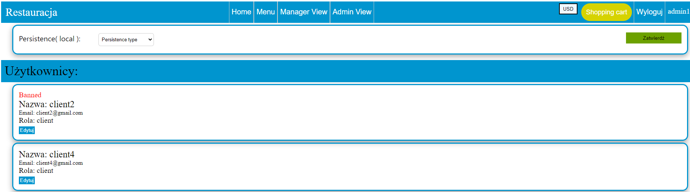

# Zad8
This project was generated with [Angular CLI](https://github.com/angular/angular-cli) version 13.0.3.

## Development server

Run `ng serve` for a dev server. Navigate to `http://localhost:4200/`. The app will automatically reload if you change any of the source files.

## Build

Run `ng build` to build the project. The build artifacts will be stored in the `dist/` directory.

## Versions:
Node: v16.15.0
Angular CLI: 13.0.4
npm: 8.5.5

## Project overview:
### Description:
This project presents a web platform for managing a restaurant.
It contains 4 basic views:

- **home view with main page of restaurant that welcomes clients**

- **menu, where clients can choose what to order**

- **manager view, where manager and admin has only access. There dishes are administrated.**

- **admin view, where only admin has access. Admin controls users and permissions to website.**

Beyond that we can register and log into web, also check details about dish or filter the menu.